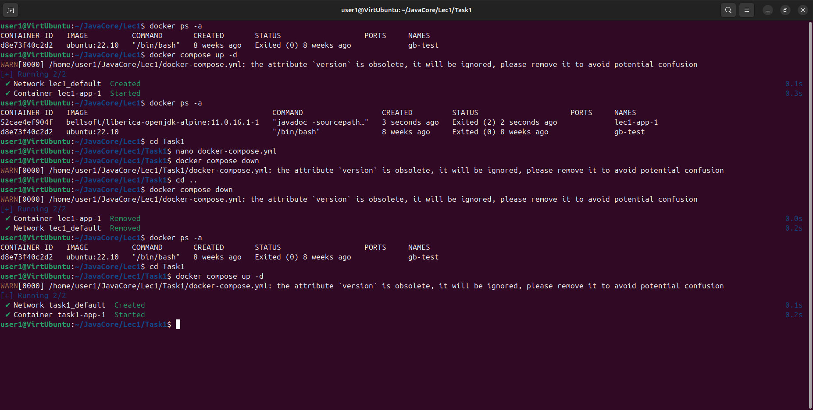

# Домашняя работа №1
Добавил класс Printer в пакете ru.gb.jcore.printer.

Выболнил компиляцию в ОС Windows:

Создал документацию:

Выполнил компиляцию в ОС Linux Ubuntu:

Создал yml файл:

Запустил контейнер для создания документации:

В директории doc находится документация, 
созданная в контейнере образа bellsoft/liberica-openjdk-alpine. 
В директории docs находится документация, созданная в ОС Windows.